```{r setup, include=FALSE}
# TIMEXEC <- function(){
#   TIMEXEC <- c()
#   for(i in 1:10){
#     temp <- system.time(result <- CONFELECTRFUNC(99))
#     TIMEXEC <- c(TIMEXEC,temp["elapsed"])
#   }
#   return(mean(TIMEXEC))
# }
name_of_var <- function(var, name = deparse(substitute(var))) {
  name
}
substrRight <- function(str, n) {
  return(substr(str, (nchar(str) + 1) - n, nchar(str)))
}
ELECTRONEGFUNC <- function(V1, V2) {
  ELECTRONEGMAX <- pmax(V1, V2)
  ELECTRONEGMIN <- pmin(V1, V2)
  DIFF <- ELECTRONEGMAX - ELECTRONEGMIN
  if (DIFF < 0.4) {
    cat(DIFF, "Non polarisée|Liaison covalente non polaire")
  } else if (DIFF <= 1.7) {
    cat(DIFF,
        "Polarisée|Liaison covalente polaire",
        ELECTRONEGMIN,
        "->",
        ELECTRONEGMAX)
  } else {
    cat(DIFF, "Liaison ionique", ELECTRONEGMIN, "->", ELECTRONEGMAX)
  }
}
concno <- function(num1, num2) {
  concno <- paste0(num1, num2)
  return(as.numeric(concno))
}
MATKLECHKOWSK <- function(DISPLAY=FALSE) {
  mat <- matrix(
    c(
      1,
      NA,
      NA,
      NA,
      
      2 + 0,
      2 + 1,
      NA,
      NA,
      
      3 + 0,
      3 + 1,
      3 + 2,
      NA,
      
      4 + 0,
      4 + 1,
      4 + 2,
      4 + 3,
      
      5 + 0,
      5 + 1,
      5 + 2,
      5 + 3,
      
      6 + 0,
      6 + 1,
      6 + 2,
      6 + 3,
      
      7 + 0,
      7 + 1,
      7 + 2,
      7 + 3
    ),
    nrow = 7,
    # n
    ncol = 4,
    # l
    byrow = TRUE
  ) # matrice de kleshkowski
  
  MATKLECHKOWSK <- c() # vecteur de MATKLECHKOWSK
  
  setClass(
    "SousCouche",
    slots = list(
      n = "numeric", # n
      l = "numeric", # l
      sum = "numeric", # n+l
      x = "numeric", # coordonnée
      y = "numeric", # coordonnée
      conc = "numeric", # concatenation pour trier n+l, n
      electr = "numeric", # electron
      sousco = "character", # souscouche
      energ = "numeric" # electrovolt
    )
  )
  
  for (i in 1:nrow(mat)) {
    # n
    for (j in 1:ncol(mat)) {
      # l
      tempj <- j - 1
      if (is.na(mat[i, j]) == FALSE) {
        if (tempj == 0) {
          MATKLECHKOWSK <- c(
            MATKLECHKOWSK,
            new(
              "SousCouche",
              n = i,
              l = tempj,
              sum = i + tempj,
              x = j,
              y = i,
              conc = concno(i + tempj, i),
              electr = 2,
              sousco = "s^",
              energ = -13.6 / (i ^ 2)
            )
          )
        } else if (tempj == 1) {
          MATKLECHKOWSK <- c(
            MATKLECHKOWSK,
            new(
              "SousCouche",
              n = i,
              l = tempj,
              sum = i + tempj,
              x = j,
              y = i,
              conc = concno(i + tempj, i),
              electr = 6,
              sousco = "p^",
              energ = -13.6 / (i ^ 2)
            )
          )
        } else if (tempj == 2) {
          MATKLECHKOWSK <- c(
            MATKLECHKOWSK,
            new(
              "SousCouche",
              n = i,
              l = tempj,
              sum = i + tempj,
              x = j,
              y = i,
              conc = concno(i + tempj, i),
              electr = 10,
              sousco = "d^",
              energ = -13.6 / (i ^ 2)
            )
          )
        } else if (tempj == 3) {
          MATKLECHKOWSK <- c(
            MATKLECHKOWSK,
            new(
              "SousCouche",
              n = i,
              l = tempj,
              sum = i + tempj,
              x = j,
              y = i,
              conc = concno(i + tempj, i),
              electr = 14,
              sousco = "f^",
              energ = -13.6 / (i ^ 2)
            )
          )
        }
      }
    }
  }
  
  
  for (i in 1:length(MATKLECHKOWSK)) {
    index <- i
    j <- i + 1
    while (j < length(MATKLECHKOWSK)) {
      if (MATKLECHKOWSK[[j]]@conc < MATKLECHKOWSK[[index]]@conc) {
        index <- j
      }
      j <- j + 1
    }
    min <- MATKLECHKOWSK[[index]]
    #tempon index
    MATKLECHKOWSK[[index]] <- MATKLECHKOWSK[[i]]
    MATKLECHKOWSK[[i]] <- min
    
  }
  
  if(DISPLAY == TRUE) {
    for (i in 1:length(MATKLECHKOWSK)) {
      print(
        paste(
          MATKLECHKOWSK[[i]]@n,
          MATKLECHKOWSK[[i]]@l,
          MATKLECHKOWSK[[i]]@sum,
          MATKLECHKOWSK[[i]]@conc,
          MATKLECHKOWSK[[i]]@electr,
          MATKLECHKOWSK[[i]]@sousco,
          MATKLECHKOWSK[[i]]@energ
        )
      )
    }
  }
  
  return(MATKLECHKOWSK)
}
MATKLECHKOWSK.ret <- MATKLECHKOWSK()
CONFELECTRFUNC <- function(Z) {
  CO <- c()
  i <- 1
  while (Z != 0 && i < length(MATKLECHKOWSK.ret)) {
    if (Z >= MATKLECHKOWSK.ret[[i]]@electr) {
      CO <-
        c(
          CO,
          paste(
            MATKLECHKOWSK.ret[[i]]@n,
            MATKLECHKOWSK.ret[[i]]@sousco,
            MATKLECHKOWSK.ret[[i]]@electr
          )
        )
      Z <- Z - MATKLECHKOWSK.ret[[i]]@electr
    } else {
      CO <-
        c(CO,
          paste(MATKLECHKOWSK.ret[[i]]@n, MATKLECHKOWSK.ret[[i]]@sousco, Z))
      Z <- Z - Z
    }
    i <- i + 1
  }
  COLLAPS <- paste(CO, collapse = ",")
  FORMACC <- gsub("\\s", "", COLLAPS)
  FORMSPACE <- gsub(",", " ", FORMACC)
  # FORMZER <-
  #   if (substrRight(FORMSPACE, 1) == "0")
  #     gsub('.{5}$', '', FORMSPACE)
  # else
  #   FORMSPACE
  FORMSPACE
}
setClass(
  "Atome",
  slots = list(
    nom = "character",
    nombre = "numeric",
    charge = "numeric",
    polarite = "character"
  )
)
IONDISSFUNC <- function(A1,
                        A2,
                        A1.state = "DISS",
                        A2.state = "NDISS") {
  if (A1.state == "DISS") {
    A1 <-
      paste(
        A1@nombre,
        A1@nom,
        if (A1@charge != 1)
          paste("^{", A1@charge, A1@polarite, "}")
        else
          paste("^{",
                A1@polarite,
                "}")
      )
  } else if (A1.state == "NDISS") {
    A1 <-
      paste(
        "{",
        A2@nom,
        if (A2@nombre != 1)
          paste("_{", A2@nombre, "}}")
        else
          "}",
        "^{",
        A2@charge,
        A2@polarite,
        "}"
      )
  }
  
  if (A2.state == "DISS") {
    A2 <-
      paste(
        A2@nombre,
        A2@nom,
        if (A2@charge != 1)
          paste("^{", A2@charge, A2@polarite, "}")
        else
          paste("^{",
                A2@polarite,
                "}")
      )
  } else if (A2.state == "NDISS") {
    A2 <-
      paste(
        "{",
        A2@nom,
        if (A2@nombre != 1)
          paste("_{", A2@nombre, "}}")
        else
          "}",
        "^{",
        A2@charge,
        A2@polarite,
        "}"
      )
  }
  DISSARR <- c(A1, A2)
  DISSARR
}
QUANTMATIER <- function(COMP) {
  MOL <- 6.02 * 10 ^ 23
  QUANTMATIER <- COMP / MOL
  cat(format(QUANTMATIER, scientific = TRUE), "mol")
} 
```

# Tableau périodique

```{r TABLPERIOD, echo=FALSE}
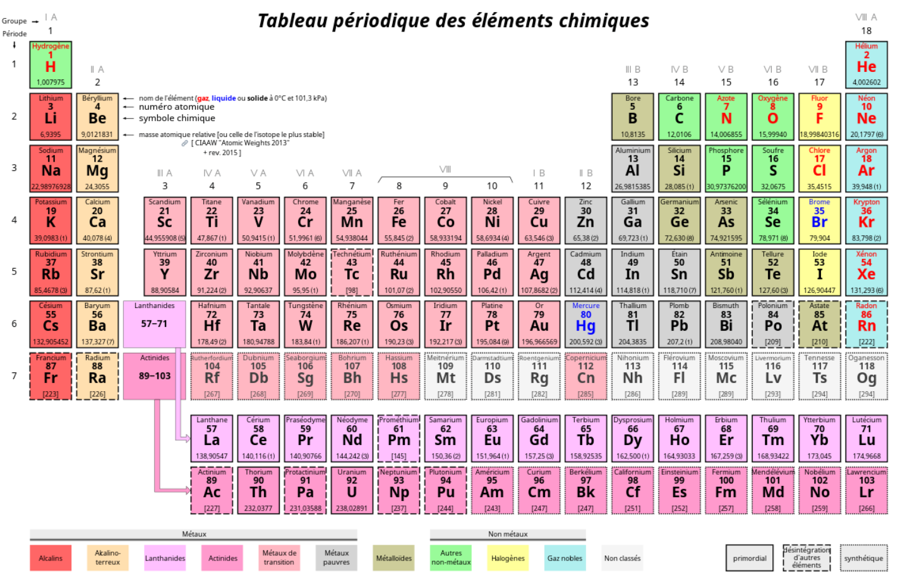 # knitr
```

## Configuration électronique

[TABLECONFELECTR](https://www.youtube.com/watch?v=bTD1ggRG1Lg&t=28s&ab_channel=PaulOlivier)

A1 : (la plus petite couche de valence) Nombre d'électron dans la couche de valence correspond au nombre de liaison possible pour un atome. Voir [Liaisons]

A2 : (la plus grande couche de valence) Nombre d'électron  manquant dans la couche de valence correspond au nombre de liaison possible par atome. Voir [Liaisons]

+ O : 2 liaisons possibles
+ H : 1 liaison par atome

Voir [La polarisation]


Les atomes appartenant au gaz noble sont peu réactifs étant donnée leur stabilité et donc ne forment pas de molécule/liaison.

[DECOUVPROT](https://www.youtube.com/watch?v=jwXbZ4-VPac&list=LL&index=12&t=234s&ab_channel=LivresetScience)

Le nombre de proton (charge électrique) = 1/2 de la masse

```{r TABLCONFELECTR, echo=FALSE}
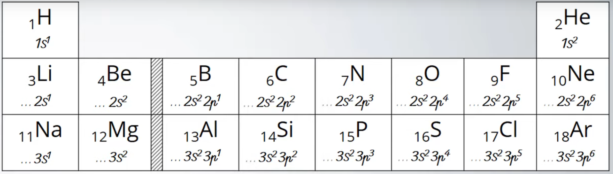 # knitr
```

À gauche, les alcalins (1 électron dans leur couche de valence (dernière couche))

À droite, les gaz nobles (8 électron dans leur couche de valence (dernière couche) ou 2 électrons dans le cas de l'Hélium (1 sous-couche étant donnée le niveau d'énergie = 1))

<br>

[VARCONFELECTR](https://www.youtube.com/watch?v=z6htekqSQBU&t=337s&ab_channel=SciencesActives)

La première couche électronique, appelée couche K, peut contenir jusqu'à 2 électrons. Cela est dû au fait que la couche K ne contient qu'un seul niveau d'énergie, représenté par la sous-couche s. La sous-couche s a une capacité maximale de 2 électrons selon le principe d'exclusion de Pauli.

[VARIABL](https://www.youtube.com/watch?v=KeI8S_FPiQw)

4 variables:
n (nombre quantique principal) : Il détermine le niveau d'énergie périnucléaire de l'électron et la distance moyenne de l'électron par rapport au noyau. Plus la valeur de n est élevée, plus l'énergie de l'électron est grande et plus il est éloigné du noyau.

l (nombre quantique secondaire ou azimutal ou orbital ou angulaire) : Il spécifie la forme de l'orbite électronique et la sous-couche électronique dans laquelle se trouve l'électron. 
m/ml (nombre quantique magnétique) : Il indique l'orientation spatiale spécifique de l'orbite électronique. Si l est = 0, m= 0. Autrement, m peut prendre les valeurs -1, 0 et +1, ce qui correspond aux trois orbitales p orientées dans les directions x, y et z.

s/ms (nombre quantique de spin) : Il décrit le spin de l'électron. Soit +1/2 (spin vers le haut) soit -1/2 (spin vers le bas) représentée par les symboles ↑ pour le spin vers le haut et ↓ pour le spin vers le bas.

À retenir:

+ 2 électrons dans la sous-couche s de la couche N ($l=0$)
+ 6 électrons dans la sous-couche p de la couche N ($l=1$)
+ 10 électrons dans la sous-couche d de la couche N ($l=2$)
+ 14 électrons dans la sous-couche f de la couche N ($l=3$)

On remplit les orbitales à ($n+l$) croissant.

En cas d'égalité on remplit la couche du plus petit $n$.

```{r CONFELECTRFE}
Fe <- 26 # numéro atomique
CONFELECTRFUNC(Fe) # configuration électronique
```

```{r IMG1, echo=FALSE}
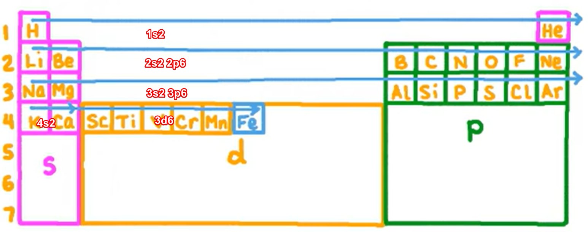 # knitr
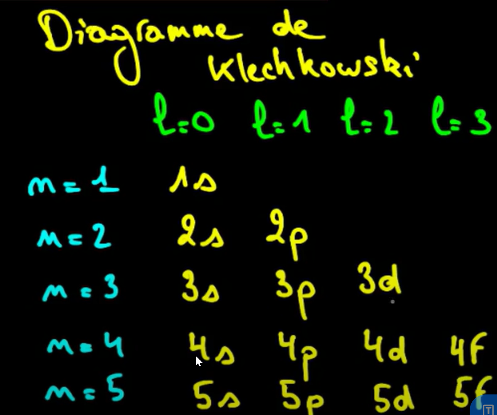 # knitr
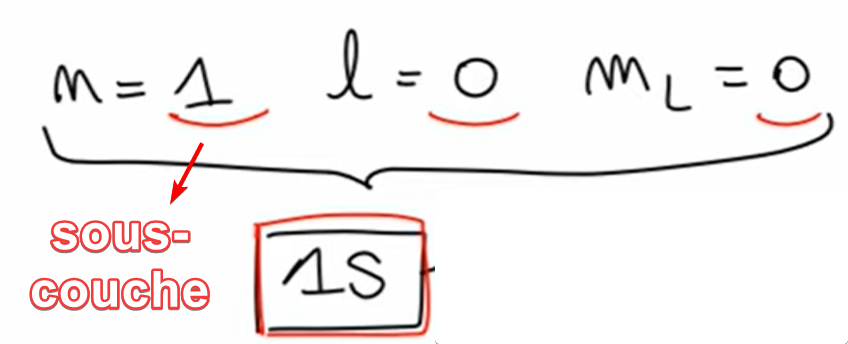 # knitr
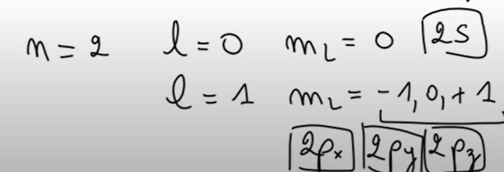 # knitr
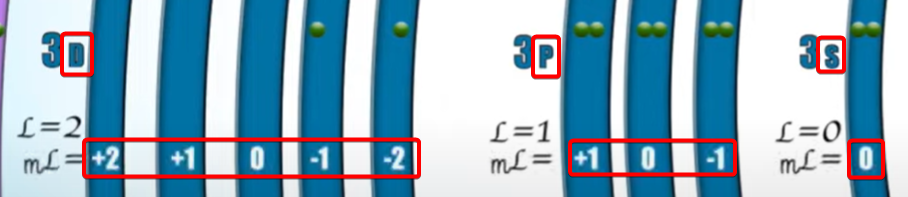 # knitr
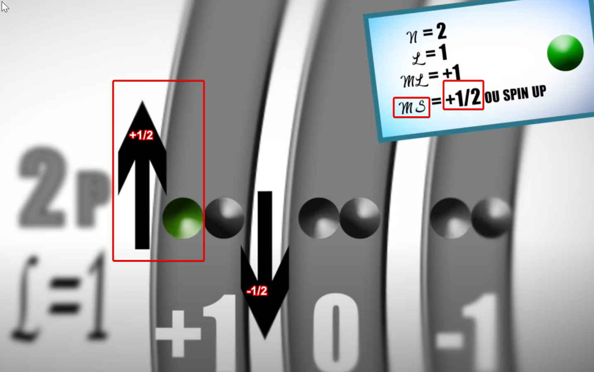 # knitr
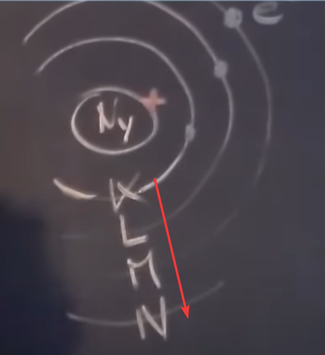 # knitr
```

Couche de valence: dernière couche

[REGLDUOCT](https://www.youtube.com/watch?v=3U9-Mhr2k9Y&ab_channel=PaulOlivier)

+ Respecte la règle du duet en couche K, n = 1, couche de valence = 2
+ Respecte la règle de l'octet, n > 1, couche de valence = 8

## Tableau des énergies

[TABLENERG](https://www.youtube.com/watch?v=wSvK9KvnET8&ab_channel=YannickSayer)

```{r TABLENERG, echo=FALSE}
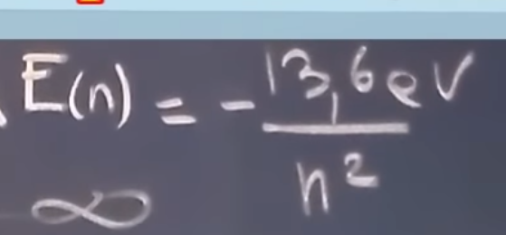 # knitr
ELECTRVOLT <- c()
for(i in 1:length(MATKLECHKOWSK.ret)){
  ELECTRVOLT <- c(ELECTRVOLT, paste(MATKLECHKOWSK.ret[[i]]@n,round(MATKLECHKOWSK.ret[[i]]@energ,2)))
}
unique(ELECTRVOLT)
```

## Loi de Coulomb

[LOICOULO](https://www.youtube.com/watch?v=2yswjX5VX8E&ab_channel=PaulOlivier)

Un atome est électroniquement neutre parce qu'il contient autant de proton que d'électron

```{r CHARGELECTRPARTIC, echo=FALSE}
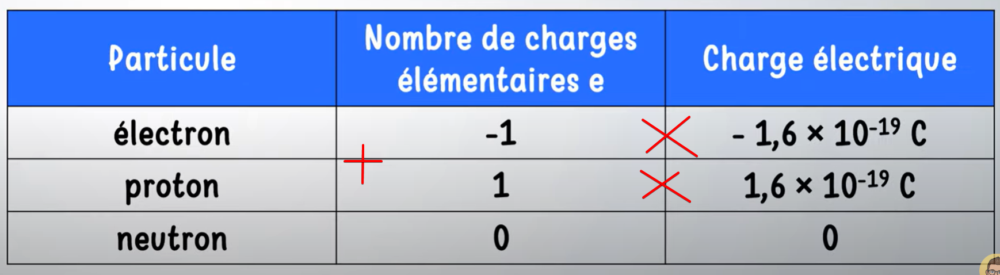 # knitr
```

Calculer l'intensité d'une force électrostatique

+ q: exprimé en Coulomb (charge électrique)
+ d: exprimé en mètre (distance)
+ F: exprimé en Newton

$$F_\frac{A}{B} = F_\frac{B}{A} = k \times \frac{q_{A} \times q_{B}}{d^{2}}$$
$$F = k_{e} \times \frac{q_{1} \times q_{2}}{r^{2}}$$

Ressemble à la loi d'interaction gravitationnelle

+ m: exprimé en kg
+ d: exprimé en mètre
+ F: exprimé en Newton

$$F_\frac{A}{B} = F_\frac{B}{A} = G \times \frac{m_{A} \times m_{B}}{d^{2}}$$

Exemple:

$$q_{A} = 4,0 \times 10^{3} C$$
$$q_{B} = -3,0 \times 10^{-1} C$$
Distance AB = 1,5 m

```{r CALCLOICOUL}

A <- 4*10^-3
B <- -3*10^-1
d <- 1.5
k <- 9*10^9
F <- k*((abs(A)*abs(B))/(d)^2)
cat(format(F, scientific = TRUE), "Newton")
```

```{r FORCATT, echo=FALSE}
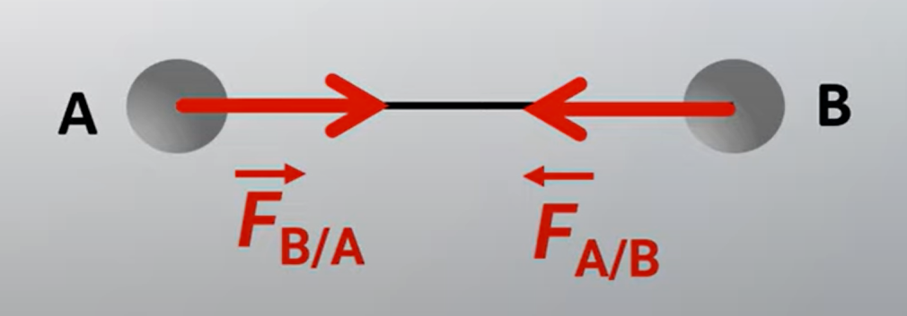 # knitr
```

Force de B sur A

Force de A sur B

# Liaisons 

Calculer la plus grande $\delta^{-}$ (le plus électronégatif) - la plus petite polarité $\delta^{+}$ (le moins électronégatif)

+ Non polarisée : Différence < 0.4
+ Polarisée : Différence 0.4-1.7
+ Ionique : Différence > 1.7

```{r TABLELECTRONEG, echo=FALSE}
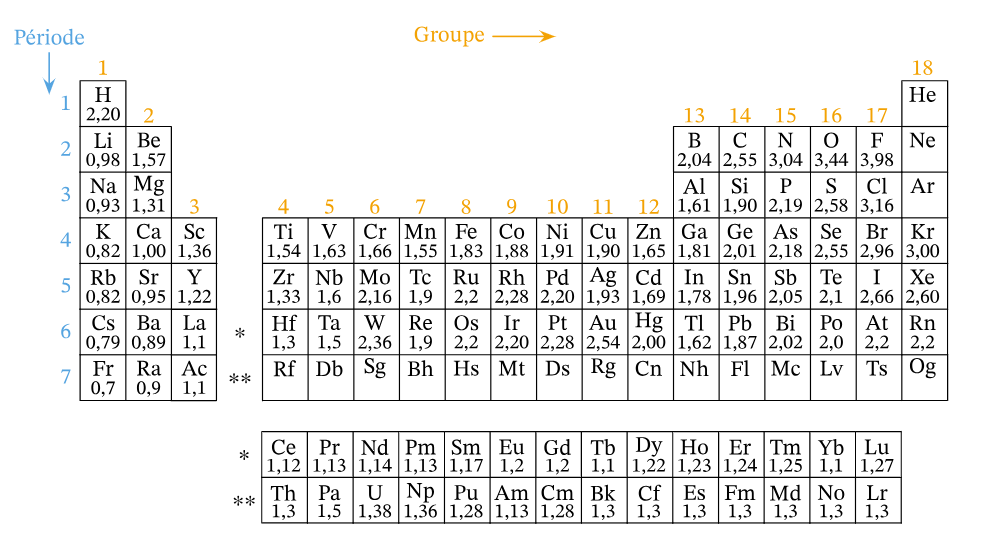 # knitr
```

## Ioniques

Cation (métal) et Anion (non métalliques)

```{r TABLMET, echo=FALSE}
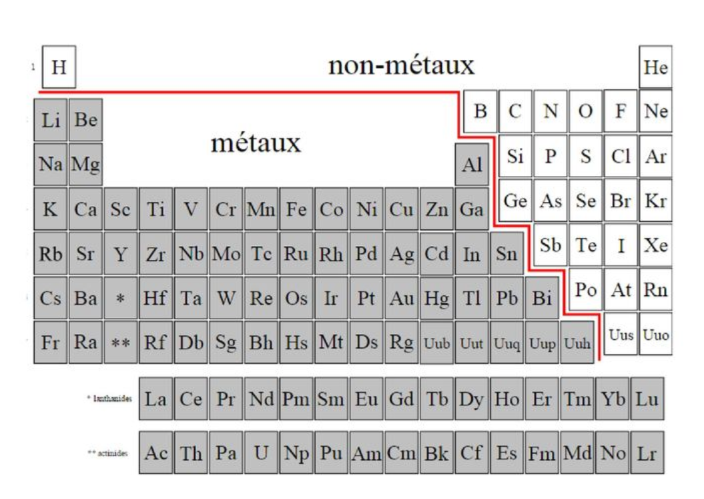 # knitr
```

Entre le Potassium et le Chlore

```{r ELECTRONEGNACL}
Na <- 0.93 # Potassium
Cl <- 3.16 # Chlore
ELECTRONEGFUNC(Na,Cl)
```

## Covalentes

### La polarisation

[CENTRGEOMETR](https://www.youtube.com/watch?v=81vc_hF9Htg&ab_channel=PaulOlivier)

Entre le Carbone et l'Hydrogène

```{r ELECTRONEGCH}
C <- 2.55 # Carbone
H <- 2.20 # Hydrogène
ELECTRONEGFUNC(C,H)
```

Entre le Hydrogène et l'Oxygène (h2o)

```{r ELECTRONEGHO}
H <- 2.20 # Hydrogène
O <- 3.44 # Oxygène
ELECTRONEGFUNC(H,O)
```

```{r ELECTRONEGHOMOL, echo=FALSE}
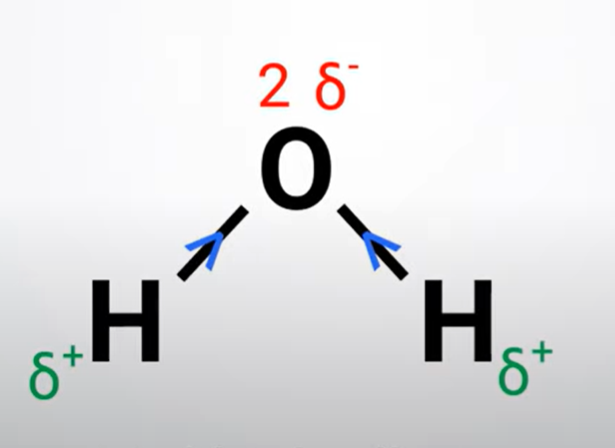 # knitr
```

Molécule polaire : Centre géométrique distinct entre les charges partielles positives et négatives 

```{r CENTRGEOMETRHOMOL, echo=FALSE}
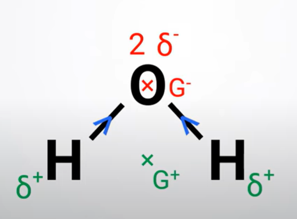 # knitr
```

Entre le Carbone et l'Oxygène (co2)

```{r ELECTRONEGCO}
C <- 2.55 # Carbone
O <- 3.44 # Oxygène
ELECTRONEGFUNC(C,O)
```

Molécule apolaire : Centre géométrique partagé entre les charges partielles positives et négatives 

```{r CENTRGEOMETRCOMOL, echo=FALSE}
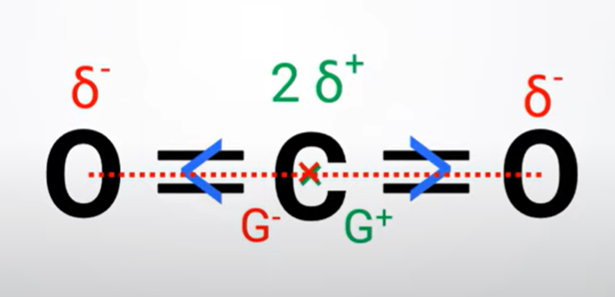 # knitr
```

+ $\delta^{+}$ : Charge partielle positive (le moins électronégatif)
+ $\delta^{-}$ : Charge partielle négative (le plus électronégatif)

### Doublet liant et non-liant

[NONLIANT](https://www.youtube.com/watch?v=3U9-Mhr2k9Y&ab_channel=PaulOlivier)

```{r NONLIANT, echo=FALSE}
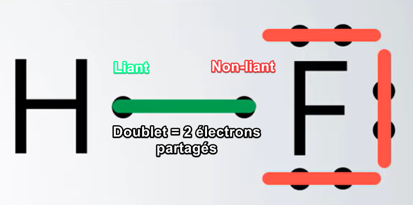 # knitr
```

```{r CONFELECTRH, results='hold'}
H <- 1 # numéro atomique
CONFELECTRFUNC(H) # configuration électronique
"Manque 1 électron dans sa couche de valence."
```

```{r CONFELECTRF, results='hold'}
F <- 9 # numéro atomique
CONFELECTRFUNC(F) # configuration électronique
"Manque 1 électron dans sa couche de valence."
```

Pour que le Fluor se rapproche de la couche de valence du gaz noble le plus proche (le Neon (numéro atomique 10) a 8 électrons dans sa couche de valence).

Pour que l'Hydrogène se rapproche de la couche de valence du gaz noble le plus proche (l'Hélium (numéro atomique 2) a 2 électrons dans sa couche de valence).

### Double liaison

[DOUBLIAIS](https://www.youtube.com/watch?v=gKZE6yp4fHw&t=18s&ab_channel=SocraticaFran%C3%A7ais)

```{r DOUBLIAISINIT, echo=FALSE}
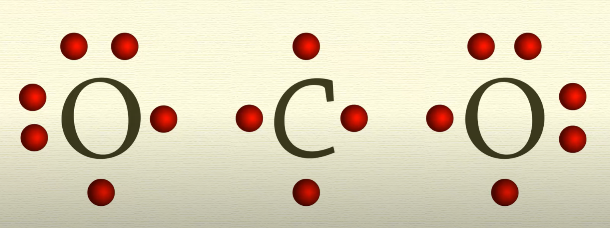 # knitr
```

```{r DOUBLIAIS, echo=FALSE}
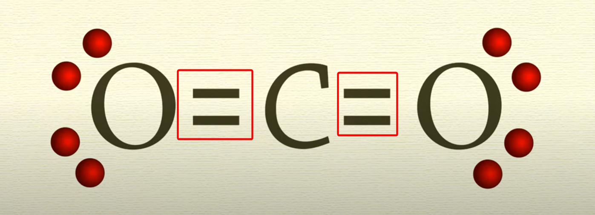 # knitr
```

```{r CONFELECTRC, results='hold'}
C <- 6 # numéro atomique
CONFELECTRFUNC(C) # configuration électronique
"Manque 4 électrons dans sa couche de valence."
```

```{r CONFELECTRO, results='hold'}
O <- 8 # numéro atomique
CONFELECTRFUNC(O) # configuration électronique
"Manque 2 électrons dans sa couche de valence."
O <- 8 # numéro atomique
CONFELECTRFUNC(O) # configuration électronique
"Manque 2 électrons dans sa couche de valence."
```

Pour que le Carbone se rapproche de la couche de valence du gaz noble le plus proche (le Neon (numéro atomique 10) a 8 électrons dans sa couche de valence).

Pour que l'Oxygène se rapproche de la couche de valence du gaz noble le plus proche (le Neon (numéro atomique 10) a 8 électrons dans sa couche de valence).

## Métalliques

## Solutions acqueuses de composé ionique

Conduisent l'électricité. Voir [Ioniques] et [Covalentes]

```{r IONNACL, echo=FALSE}
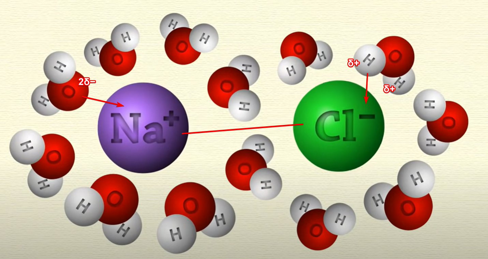 # knitr
```

Exception (dissolution)

```{r TABLREGLSOLUB, echo=FALSE}
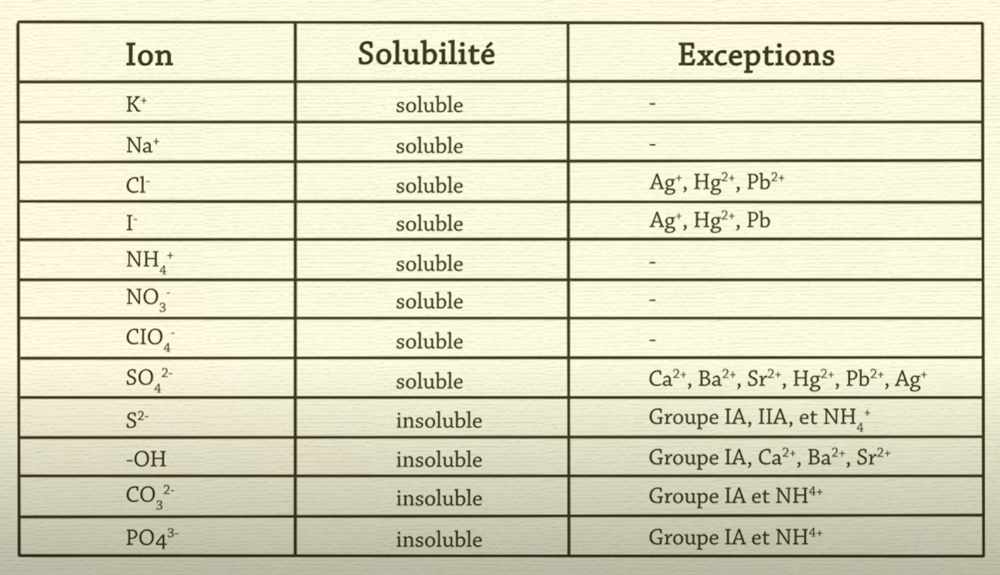 # knitr
```

# Ion

## Positif (Cation+ attire cathode-) ou négatif (Anion- attire l'anode+)

[IONPOS](https://www.youtube.com/watch?v=3okQp-SHmaw&ab_channel=PaulOlivier)

```{r IONPOS, echo=FALSE}
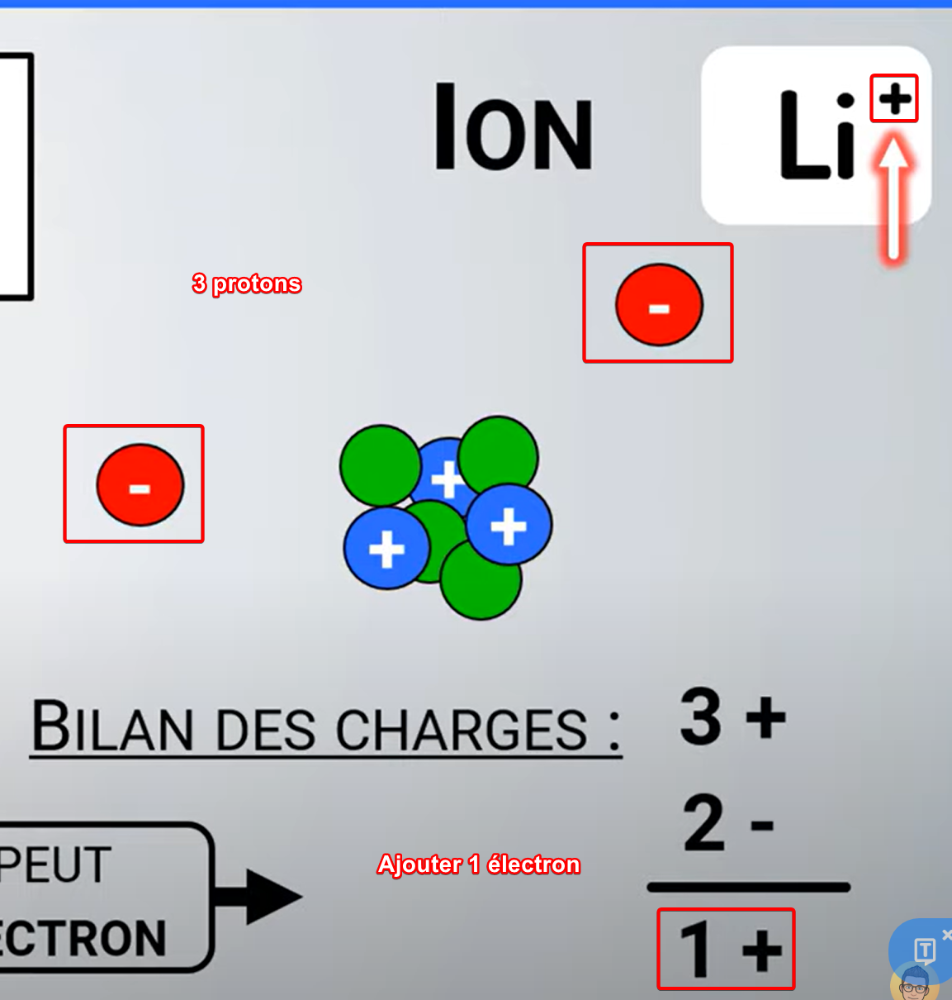 # knitr
```

Le Lithium veut se rapproche de la configuration électronique de l'Hélium. Voir [Configuration électronique].

[TABLION](https://www.youtube.com/watch?v=bzSWDPlW0tY&ab_channel=PaulOlivier)

```{r TABLION, echo=FALSE}
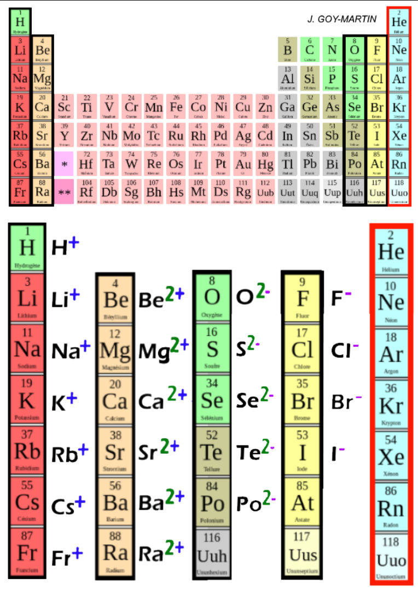 # knitr
```

## Monoatomique et polyatomique

[IONMONOPOLY](https://www.youtube.com/watch?v=bzSWDPlW0tY&ab_channel=PaulOlivier)

```{r IONPOLY, echo=FALSE}
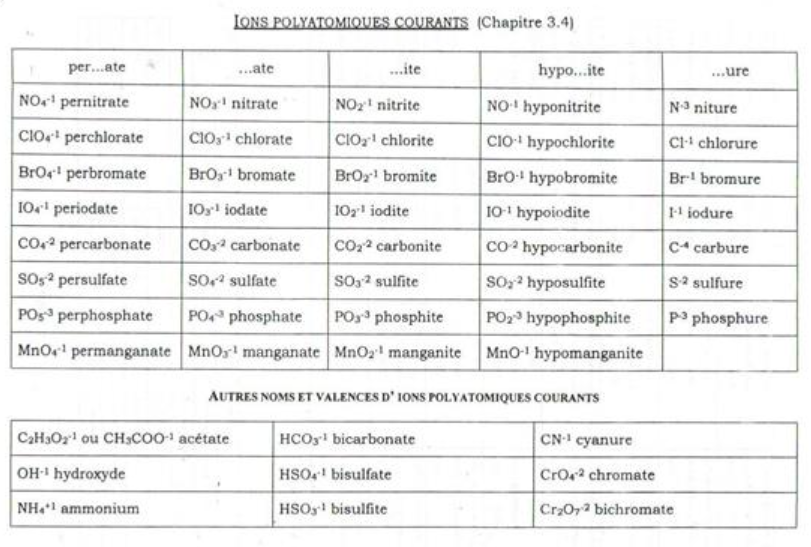 # knitr
```

## Formule des composés ioniques

[IONFORM](https://www.youtube.com/watch?v=cU7B3W8dFYA&ab_channel=PaulOlivier)

Voir [Ion]

```{r IONCACL, echo=FALSE}
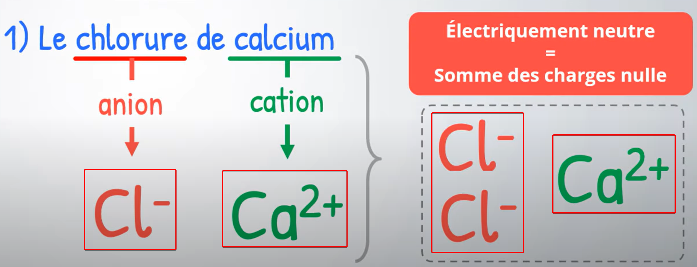 # knitr
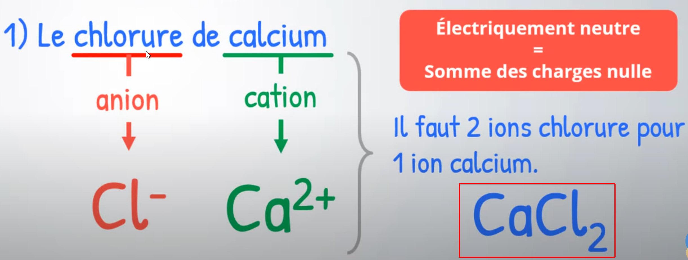 # knitr
```

### Équation de dissolution (opération inverse). Voir [Monoatomique et polyatomique] [Ion]

[IONDISS](https://www.youtube.com/watch?v=MdVVvpwIuH8&ab_channel=PaulOlivier)

```{r IONDISSCACL, results='asis'}
# L'atome dissous est celui qui a un nombre plus élevé que la normale
# a1.nombre * a1.charge = a2.charge
# a1.charge respecte TABLION
Cl <- new("Atome", nom="Cl", nombre=2, charge=1, polarite="-")
Ca <- new("Atome", nom="Ca", nombre=1, charge=2, polarite="+")
CaCl <- IONDISSFUNC(Cl, Ca)
```

$`r CaCl[1]`+`r CaCl[2]`$

```{r IONFORM, echo=FALSE}
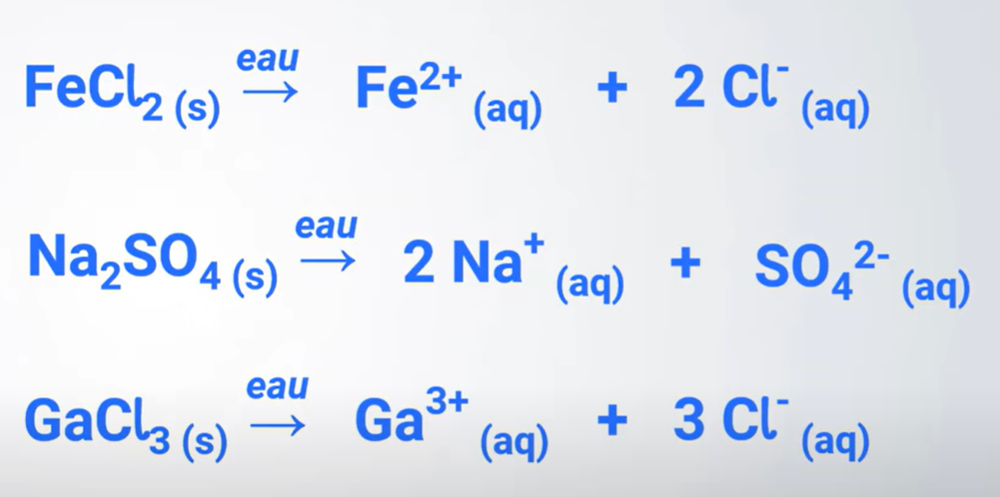 # knitr
```

```{r IONDISSFECL, results='asis'}
# L'atome dissous est celui qui a un nombre plus élevé que la normale
# a1.nombre * a1.charge = a2.charge
# a1.charge respecte TABLION
Cl <- new("Atome", nom="Cl", nombre=2, charge=1, polarite="-")
Fe <- new("Atome", nom="Fe", nombre=1, charge=2, polarite="+")
FeCl <- IONDISSFUNC(Cl, Fe)
```

$`r FeCl[1]`+`r FeCl[2]`$

```{r IONDISSNASO, results='asis'}
# L'atome dissous est celui qui a un nombre plus élevé que la normale
# a1.nombre * a1.charge = a2.charge
# a1.charge respecte TABLION
# Ion monoatomique
Na <- new("Atome", nom="Na", nombre=2, charge=1, polarite="+")
# Ion polyatomique
SO <- new("Atome", nom="SO", nombre=4, charge=2, polarite="-")
NaSO <- IONDISSFUNC(Na, SO)
```

$`r NaSO[1]`+`r NaSO[2]`$

```{r IONDISSGACL, results='asis'}
# L'atome dissous est celui qui a un nombre plus élevé que la normale
# a1.nombre * a1.charge = a2.charge
# a1.charge respecte TABLION
Cl <- new("Atome", nom="Cl", nombre=3, charge=1, polarite="-")
Ga <- new("Atome", nom="Ga", nombre=1, charge=3, polarite="+")
GaCl <- IONDISSFUNC(Cl, Ga)
```

$`r GaCl[1]`+`r GaCl[2]`$

```{r IONDISSHO, results='asis'}
# L'atome dissous est celui qui a un nombre plus élevé que la normale
# a1.nombre * a1.charge = a2.charge
# a1.charge respecte TABLION
H <- new("Atome", nom="H", nombre=2, charge=1, polarite="+")
O <- new("Atome", nom="O", nombre=1, charge=2, polarite="-")
HO <- IONDISSFUNC(H, O)
```

$`r HO[1]`+`r HO[2]`$

# Avocadro et quantité de matière (mol)

[AVOCADRO](https://www.youtube.com/watch?v=RkQ-Q5jL110&ab_channel=PaulOlivier)

```{r AVOCADRO}
QUANTMATIER(5.05*10^20) # nombre d'atome, return(quantité de matière)
```

# Électrolyse

```{r ELECTROLYS, echo=FALSE}
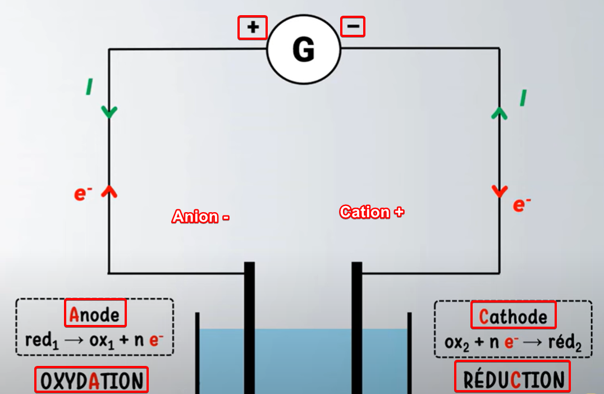 # knitr
```

# Catalyseur

## Catalyseur biologique

Les enzymes

## Catalyseur homogène

# La cinétique

[CINETIQ](https://www.youtube.com/watch?v=4OFdDuZ7YZc&ab_channel=Profcoudert)

Cinétique: vitesse de réaction

Équation de réaction macroscopique

$$v=f(A,B)$$

Facteurs cinétiques

+ concentration des réactifs AB
+ température
+ catalyseur


# [MCGILL20_40](./mcgill20_40.pdf)

## La théorie de King
## L'électromagnétisme
## L'acoustique
## La météorologie avec Barnes
## La géophysique
## L'effet Stark
## La loi de l'effet photoélectrique d'Einstein
## La loi de Planck
## Théorie de la chaleur spécifique des solides
## Mesure de l'intensité des raies spectrales de l'atome d'hydrogène soumis à l'effet Stark
## La théorie de Kramers
## Les concepts de spin
## La diffraction des électrons
## La mécanique ondulatoire
## La notion d'onde et de corpuscule

# [NIELS_BOHR](./niels_bohr.pdf)

## Le modèle de la goutte pour le noyau atomique
## Le calcul des indéterminations des composantes du champ électromagnétique
## Les principes de correspondance
## La complémentarité et superposition
## L'interprétation de Copenhague
## Le paradoxe d'Einstein
## Le paradoxe de Podolsky
## Le paradoxe de Rosen
## Le paradoxe de Zénon
## Le principe de correspondance
## L'énergie et la mécanique Hamiltonienne
### [ENERMECHAM](https://www.youtube.com/watch?v=rIuIkj67YvA&ab_channel=ScientiaEgregia)

Exemple du pendule:

+ l: longueur du pendule
+ m: masse
+ $\theta$: angle 

```{r PEND, echo=FALSE}
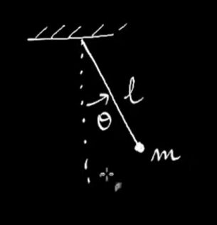 # knitr
```

<br>

+ c: cinétique
+ p: potentielle
+ h: hauteur $-l cos \theta$

$$E = E_{c} + E_{p} = (\frac{1}{2} \times mv^2) + (mg \times h)$$

# Dérivée

[DERIVEE](https://youtu.be/RLEE-iSBimc)

$$\frac{f(a + h) - f(a)}{h}$$
$$\frac{(a+h)^2 - a^2}{h}$$
$$\frac{a^2 + 2ah + h^2 - a^2}{h}$$
$$\frac{2ah + h^2}{h}$$
$${2a + h}$$
$${2a}$$
Coefficient directeur de la tangente en x

Dérivée de $x^2$ ($a^2$)

Notation f prime de x

$$f'(x) = 2x$$

Notation autres pour la dérivée d'une fonction $y=f(x)$

+ $\frac{dy}{dx}$
+ $\dot{y}$

[DERIVEE2](https://www.youtube.com/watch?v=9Mann4wOGJA&list=PLVUDmbpupCaoY7qihLa2dHc9-rBgVrgWJ&ab_channel=YvanMonka)

| Fonction $f$ | Dérivée $f'$ | Exemple $f$ | Exemple $f'$
| :------:  | :------: | :------: | :------:
| $f(x)=a,a \in \mathbb{R}$ | $f'(x)=0$ | $f(x)=3$ | $f'(x)=0$
| $f(x)=ax,a \in \mathbb{R}$ | $f'(x)=a$ | $f(x)=5x$ | $f'(x)=5$
| $\underline{f(x)=x^n}$ | $\underline{f'(x)=nx^{n-1}}$ | $\underline{f(x)=x^5}$ | $\underline{f'(x)=5x^{4-1}}$
| $f(x)=\frac{1}{x^n}$ | $f'(x)=-\frac{n}{x^{n+1}}$ | $f(x)=\frac{1}{x^3}$ | $f'(x)=-\frac{3}{x^{3+1}}$
| $f(x)=\sqrt x$ | $f'(x)=\frac{1}{2 \sqrt x}$ | $f(x)=\sqrt x$ | $f'(x)=\frac{1}{2 \sqrt x}$

# Champ magnétique généré par un aimant

[CHMAGN](https://www.youtube.com/watch?v=A4n51XsmaX8&list=PL-vrUYMihOdXEGY-xmHO9vFkh4AFLDhhZ&ab_channel=JonathanDumas)

+ $\overrightarrow{B}$: vecteur en un point
+ direction: tangente à la ligne de champ en ce point
+ sens: sort du, entre dans (sud, nord)
+ grandeur/force du champ magnétique:
  + dépend de l'aimant
  + dépend de la distance
  + se mesure en $T$ (teslas)

<br>

+ Notion de vecteur (horlogé)
  + plongeant (droite)
  + sortant (gauche)
  
+ Notion de vecteur (anti-horlogé)
  + sortant (gauche)
  + plongeant (droite)
  
```{r EXTINTMAGN, echo=FALSE}
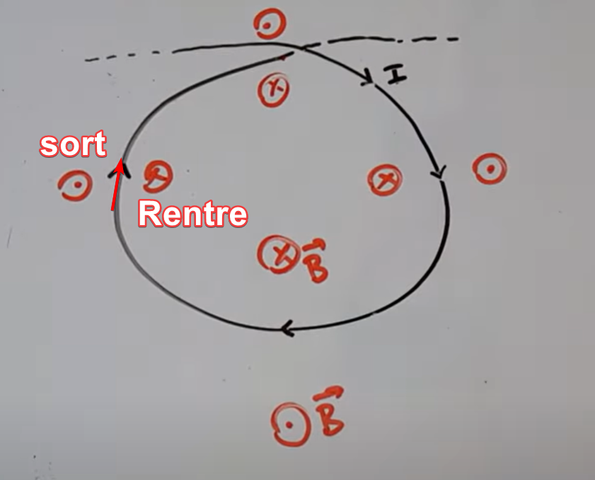 # knitr
```

+ Sort toujours du nord et plonge dans le sud

```{r CHMAGN, echo=FALSE}
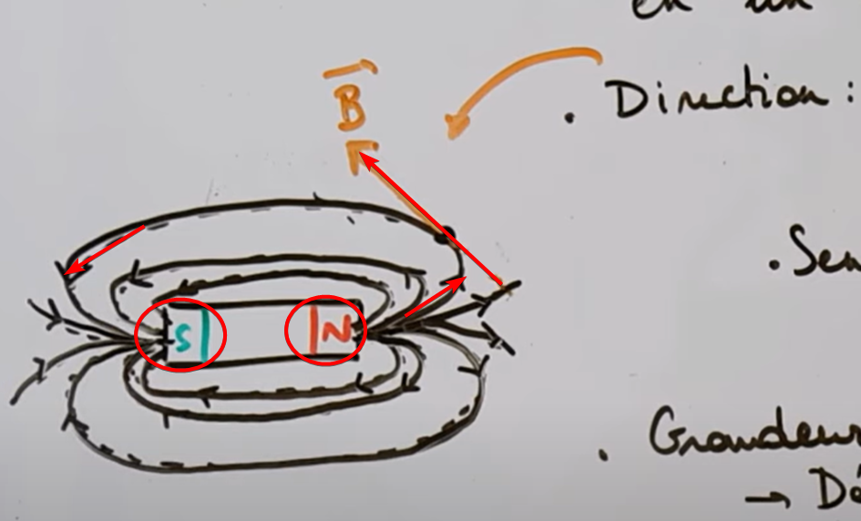 # knitr
```

[ELECTRMAGN](https://www.youtube.com/watch?v=6KB5AyLt3yA&list=PL-vrUYMihOdXEGY-xmHO9vFkh4AFLDhhZ&index=2&ab_channel=JonathanDumas)

```{r ELECTRMAGN, echo=FALSE}
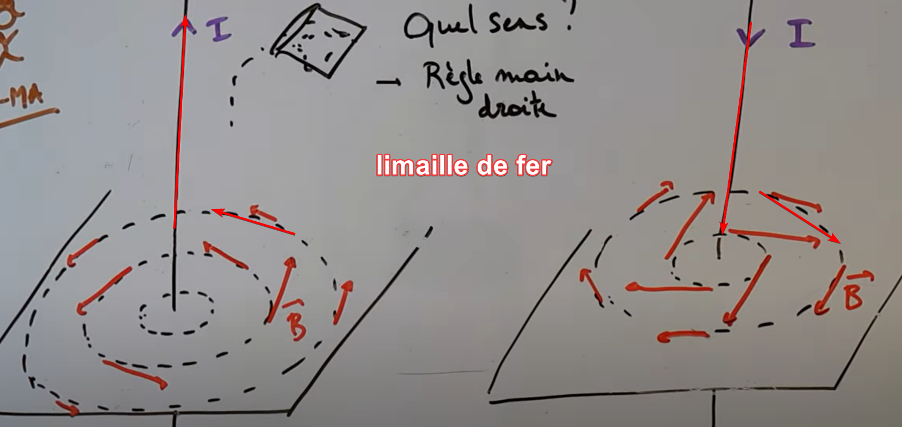 # knitr
```

## Électroaimant

Enrouler un solénoïde sur un matériau qui a une grande perméabilité magnétique (fer)

```{r ELECTRAIM, echo=FALSE}
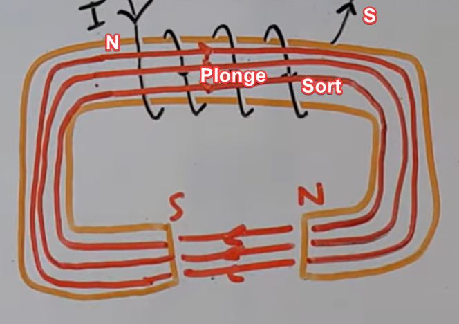 # knitr
```

[FORCELORENTZ](https://www.youtube.com/watch?v=wqiA6vqZ92U&list=PL-vrUYMihOdXEGY-xmHO9vFkh4AFLDhhZ&index=4&ab_channel=JonathanDumas)

Réaction d'un proton dans un champ magnétique

```{r FORCELORENTZ, echo=FALSE}
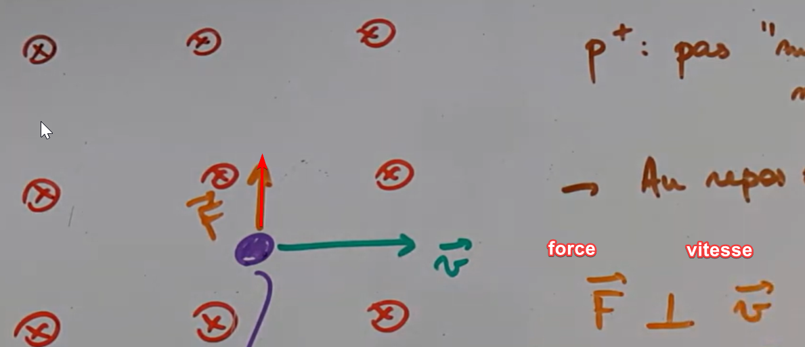 # knitr
```

# Étape pour calculer un atome

+ Calculer [Ion] ou la [Configuration électronique]
+ Dessiner les liaisons [Covalentes] y compris les polarisations 


```{r IONDISSNO, results='asis'}
# L'atome dissous est celui qui a un nombre plus élevé que la normale
# a1.nombre * a1.charge = a2.charge
# a1.charge respecte TABLION
N <- new("Atome", nom="N", nombre=2, charge=1, polarite="+")
O <- new("Atome", nom="O", nombre=5, charge=2, polarite="-")
NO <- IONDISSFUNC(N, O,A2.state="DISS")
```

$`r NO[1]`+`r NO[2]`$
